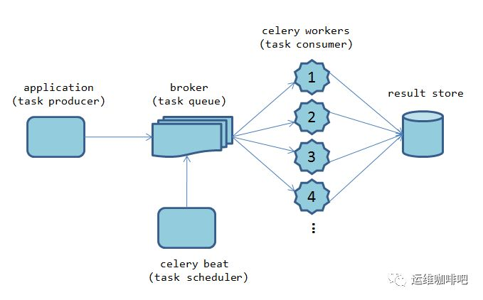

# Celery原理简介

celery是一个基于python开发的简单、灵活且可靠的分布式任务队列框架，支持使用任务队列的方式在分布式的机器/进程/线程上执行任务调度。采用典型的生产者-消费者模型，主要由三部分组成：
1. 消息队列broker：broker实际上就是一个MQ队列服务，可以使用Redis、RabbitMQ等作为broker
2. 处理任务的消费者workers：broker通知worker队列中有任务，worker去队列中取出任务执行，每一个worker就是一个进程
3. 存储结果的backend：执行结果存储在backend，默认也会存储在broker使用的MQ队列服务中，也可以单独配置用何种服务做backend

工作原理图:
